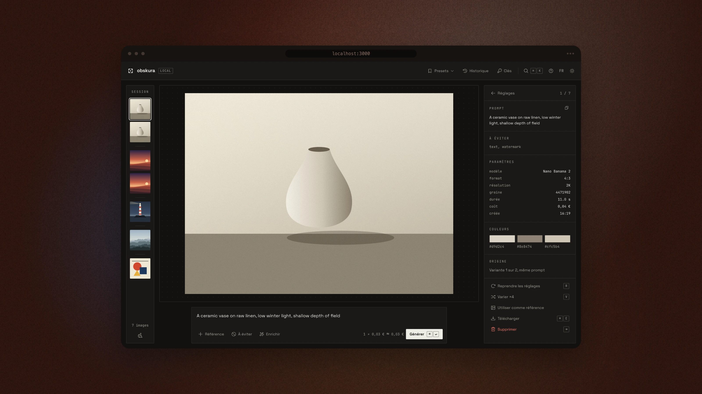
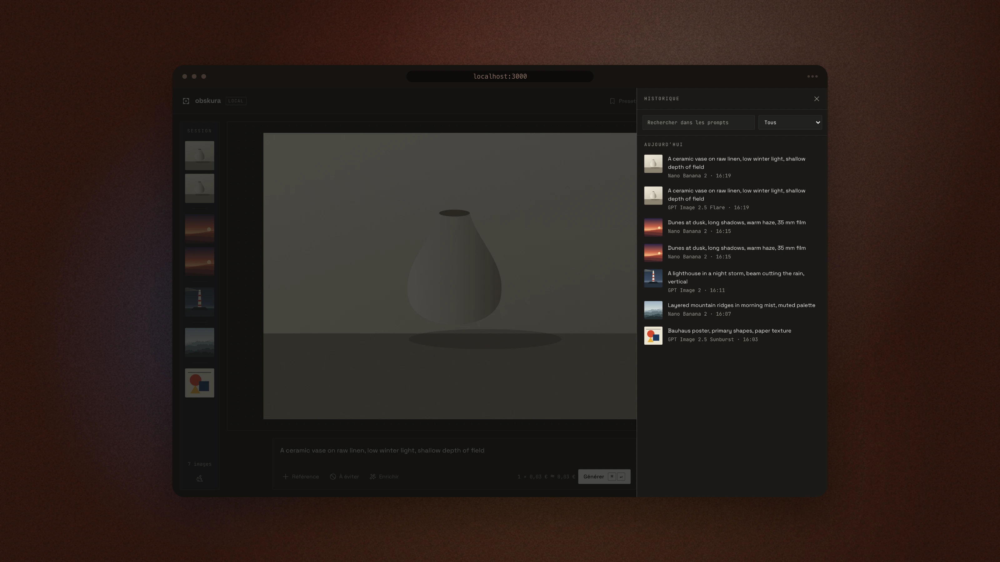
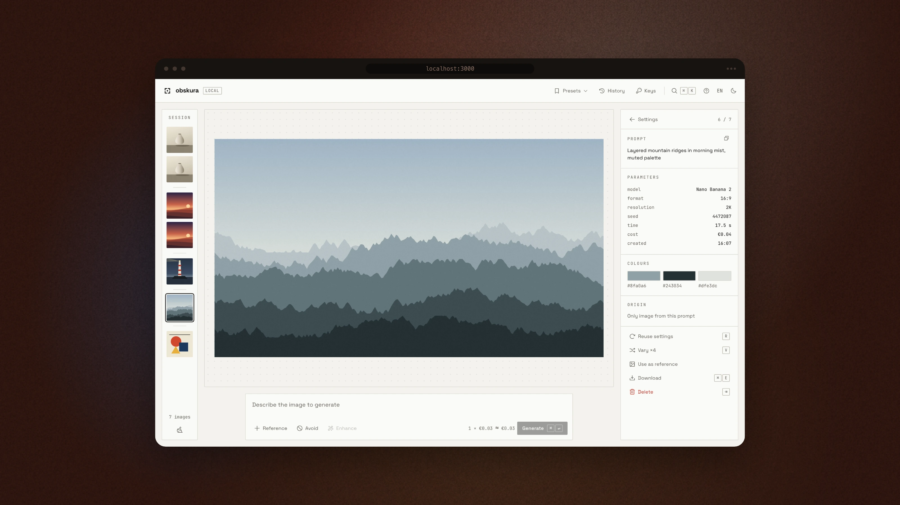

<div align="center">

# Obskura

**A local-first workshop for image generation.**
One prompt, several models, side by side — no account, no database, no server that keeps your keys.

[](https://github.com/samuelboulery/obskura/actions/workflows/ci.yml)
[](LICENSE)
[](https://nextjs.org)
[](tsconfig.json)

[Quick start](#quick-start) · [Why](#why) · [Models](#models) · [How it works](#how-it-works) · [Français](README.fr.md)



<sub>Framed with <a href="https://github.com/samuelboulery/screenmat">screenmat</a>. Demo session: the visuals are drawn on a canvas by the screenshot script, not model output. Regenerate them with <code>SCREENMAT=../screenmat node scripts/screenshots.mjs</code> while <code>pnpm dev</code> runs.</sub>

</div>

---

## Why

Most image-generation front-ends hide the request. You move a slider, something happens, and you never learn whether the model actually received the value — or silently dropped it.

Obskura does the opposite. **The inspector shows the real request body**, built by the same pure function the adapter sends. And it only shows the settings the selected model actually reads: switch model and the controls it ignores disappear, with a note saying what was added and removed. What you see is what leaves your browser.

<div align="center">

</div>

## Features

- **Four models, one prompt** — `nano-banana-2` (Gemini 3.1 Flash Image), `gpt-image-2`, `gpt-image-2.5-sunburst` and `gpt-image-2.5-flare`. Tick *in parallel* in the model menu to run a second model on identical input; results arrive as a pair.
- **One workspace, driven by selection** — nothing selected: settings. One image: its sheet (prompt, settings, palette, origin, *Reuse*, *Vary ×4*, *Use as reference*). Two: side-by-side comparison with the differences listed. More: export as original, PNG or JPEG, with a settings manifest.
- **Undo instead of confirm** — deleting, keeping one of a pair or enriching a prompt can be undone from the status line or with <kbd>⌘Z</kbd>.
- **Keys asked for when needed** — generating without a key shows a key card on the stage; nothing is sent, and the generation starts as soon as the key is saved.
- **Honest payloads** — every adapter exposes a genuinely pure `buildPayload()`: no randomness, no clock, so the inspector renders the exact object that will be sent. The seed is drawn once by the caller and travels with the request, then is stored on the resulting image — an unlocked generation stays reproducible.
- **Per-model capabilities** — a single descriptor per model (`lib/adapters/capabilities.ts`) drives payload pruning, request validation and the inspector. Removing a setting from a model removes the field from the wire, hides the control *and* fails a contract test.
- **Recipes** — save references, weights, prompt suffix, negative and render settings as a reusable preset. Export and import as plain `.json`.
- **Subject & style references** — drop images on the stage (left half subject, right half style), weight them when the model reads weights, lock identity, transfer palette.
- **Prompt enrichment** — rewrite a prompt through a text model using *your* key. No server key is ever used for this.
- **Paper and ink** — dark first, light second, French and English; the chrome carries no colour, so the images keep all of it.
- **Local cost estimate** — a per-image price you can edit; the app queries no pricing API.
- **Keyboard first** — <kbd>⌘↵</kbd> generates, <kbd>⌘K</kbd> opens every action, <kbd>?</kbd> lists the shortcuts.

## A tour

| | |
|---|---|
|  |  |
| **Compare** — two images side by side, every difference listed. | **In parallel** — two models, one prompt, progress against their usual time. |
|  |  |
| **Model menu** — key status, price per image, *in parallel*. | **Export** — original, PNG or JPEG, with a settings manifest. |
|  |  |
| **First contact** — the key is asked for on the stage; nothing is sent. | **⌘K** — every action, model, preset and preference. |
|  |  |
| **History** — search, filter by model, prompt changes as a diff. | **Light theme, English** — paper and ink both ways. |

<div align="center">

<br><sub>Under 640 px the strip becomes a row and the inspector opens as a sheet.</sub>
</div>

## Quick start

```bash
git clone https://github.com/samuelboulery/obskura.git
cd obskura
pnpm install
pnpm dev
```

Open <http://localhost:3000>, write a prompt and press <kbd>⌘↵</kbd>: the stage asks for the key it needs the first time.

> **pnpm only.** `npm`, `yarn` and `bun` are not supported — the lockfile and the `packageManager` field pin pnpm.

### Getting keys

| Model | Key from |
|---|---|
| `nano-banana-2` | [Google AI Studio](https://aistudio.google.com/apikey) |
| `gpt-image-2` · `gpt-image-2.5-*` | [OpenAI platform](https://platform.openai.com/api-keys) |

Keys are typed by you, held in `localStorage`, and forwarded as an `x-api-key` header to this app's own API routes. They are never bundled, never logged, never persisted server-side.

### Optional server fallback

For a shared demo instance you can supply fallback keys instead — copy `.env.local.example` to `.env.local`:

```bash
GEMINI_API_KEY=...   # optional fallback for nano-banana-2
OPENAI_API_KEY=...   # optional fallback for gpt-image-2
```

Prompt enrichment deliberately has **no** server fallback: it always spends the user's own text key, or stays inactive.

## Models

| Capability | `nano-banana-2` | `gpt-image-2` · `gpt-image-2.5-*` |
|---|:---:|:---:|
| Aspect ratio | ✅ | ✅ `size` |
| Resolution | ✅ `imageConfig.imageSize` | ✅ derived quality (1K→low, 2K→medium, 4K→high; 6K→xhigh, 8K→max on 2.5) |
| Variants per run | ✅ `candidateCount` | ✅ `n` |
| Seed | ✅ | — |
| File type / transparency / compression | — | ✅ |
| `personGeneration` | ✅ | — |
| Moderation | — | ✅ |
| Image references | ✅ `inlineData` | ✅ |

Neither API exposes a dedicated negative-prompt field, so the negative is **merged into the end of the prompt** after de-duplication against the preset's own negative. The request block in the inspector shows the result.

## How it works

```
app/
  page.tsx                 shell: top bar · strip · stage + composer · inspector
  api/generate/route.ts    image proxy — validates, rate-limits, picks adapter
  api/enrich/route.ts      prompt rewrite with the user's own key
components/atelier/
  TopBar · Strip · Composer · ui (primitives) · commands · use-shortcuts
  stage/      Stage · KeyCard
  inspector/  Settings · Image · Failure · Pair · Multi · ModelMenu · …
  overlays/   Dialog · PresetsMenu · HistoryDialog · KeysDialog · CommandPalette · ShortcutsDialog
lib/
  adapters/  capabilities · nano-banana-2 · gpt-image (factory) · shared · payload · validate
  atelier/   use-atelier (state) · reducer · session-view · undo · storage · recipes · export · diff · cost
  i18n/      fr (reference) · en — typed dictionaries, no library
```

Adding a model is one file in `lib/adapters/` implementing `GenerateImageAdapter`, plus one entry in `MODELS` (`capabilities.ts`). The inspector, the payload pruning and the validation follow automatically.

**Design rules the codebase holds itself to:**

- No API call leaves a React component — everything goes through `app/api/`.
- No secret in a `NEXT_PUBLIC_*` variable, ever.
- TypeScript strict, no `any`, no state mutation.
- Deliberate shortcuts carry a `ponytail:` comment naming their ceiling.

### Privacy & storage

Nothing is stored outside your browser. `localStorage` holds:

| Key | Contents |
|---|---|
| `gemini_api_key` · `openai_api_key` · `text_api_key` | your keys |
| `imgc.recipes` | saved presets |
| `imgc.session` | current session, capped, images as base64 |
| `imgc.params` | current settings |
| `imgc.prefs` | theme, language, prices, enrichment key and instructions |

The API routes apply a naive in-memory rate limit (10 requests/minute). It resets on restart and does not survive multiple instances — enough for a single self-hosted deployment, not for a public service.

`X-Forwarded-For` is only trusted when `TRUSTED_PROXY_COUNT` says how many proxies sit in front of the app; otherwise the header is ignored, since a client can forge it to get a fresh quota on every request.

Both POST routes reject cross-origin requests (`Sec-Fetch-Site`, falling back to `Origin`) and anything that is not `application/json` — without that pair, a third-party page could spend a shared instance's fallback key through a simple no-preflight request. Every field of the request body is validated against an explicit allow-list before it reaches an adapter, and `extraParams` cannot overwrite structural fields such as `model`, `n` or `moderation`.

## Scripts

```bash
pnpm dev         # dev server on :3000
pnpm build       # production build
pnpm lint        # ESLint
pnpm typecheck   # tsc --noEmit
pnpm test        # Vitest — pure logic (adapters, reducer, storage, recipes…)
pnpm test:e2e    # Playwright — critical path
```

## Contributing

Issues and pull requests are welcome. Before opening a PR, run `pnpm lint && pnpm typecheck && pnpm test`.

The UI copy and code comments are in French; identifiers and this README are in English. New code should follow the same split.

## License

[MIT](LICENSE) © Samuel Boulery
